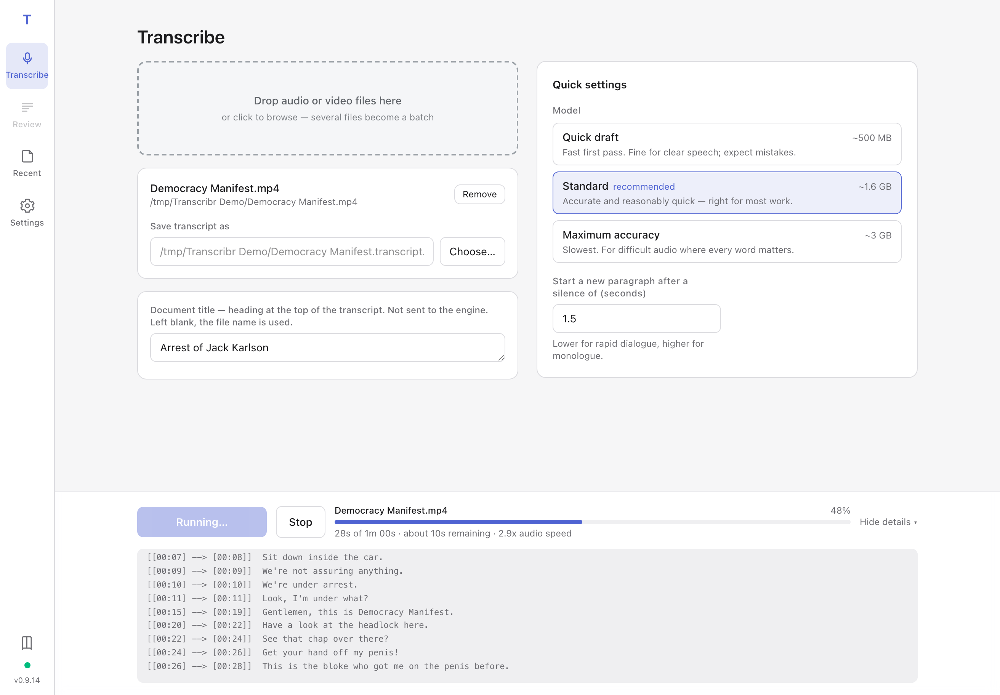
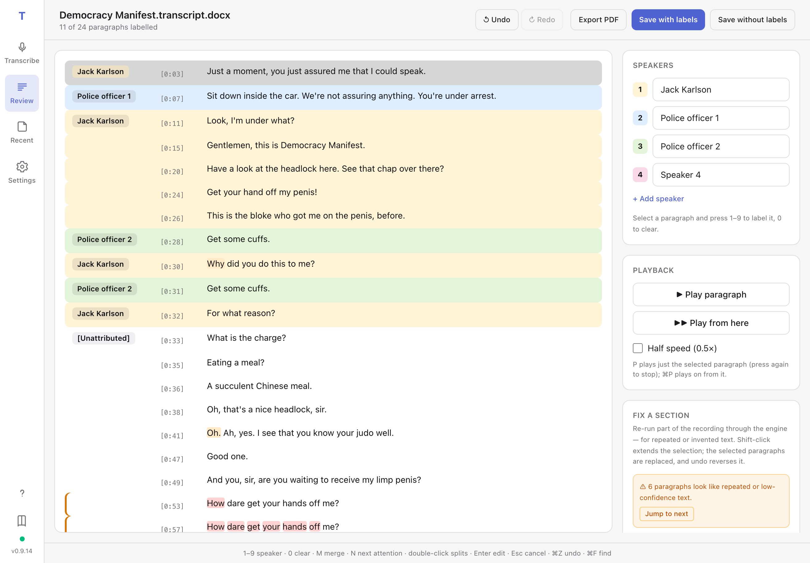

# Transcribr

(c) James Leaver, 2026. Version 0.9.14.

Demonstration video here: [https://www.youtube.com/watch?v=CzjPhhO6zNU&t=440s](https://www.youtube.com/watch?v=CzjPhhO6zNU&t=440s)

An experimental GUI for transcribing audio and video files on macOS and
Windows. A Whisper engine (faster-whisper by default; mlx-whisper and
openai-whisper where installed) does the transcription, an optional
speaker-detection pass works out who is speaking, the result is grouped
into likely paragraphs, and a built-in review pane lets you check and
label speakers, edit text, search and replace, and play each paragraph
from the source audio before saving as Word (`.docx`), PDF, or plain
text. Several files can be queued and transcribed in one unattended
batch.

The review pane also lets you **edit or hide the timestamp** on any
paragraph, and it does two things automatically to help with poor
recordings: stretches of a file with **no recorded audio** (a
microphone that switches on late, a muted channel) are marked in the
transcript instead of being filled with invented text, and paragraphs
that look like engine **hallucination** — runaway repeated words, or
text the engine itself scored as very low confidence — are flagged for
your attention. Where a passage did come out garbled, you can select
those paragraphs and **re-transcribe just that section** of the
recording with different settings.

**Everything runs locally on your computer — no audio, video, or
transcripts are uploaded to the internet.** This may be particularly
important for lawyers who need to create transcriptions of material
that it may not be appropriate to uploaded to an external website or
AI service (for example, material that is subject to non-publication or
suppression orders, the implied (_Harman_) undertaking, material
produced on subpoena, or any material that is the subject of a statutory
prohibition upon publication).

The quality of the transcription will depend on the quality of the audio
fed into it, as well as various settings that can be configured by the
user. Good quality audio will usually produce good quality transcript.
**Accuracy tuning** settings can be adjusted that will improve the quality
of poor transcripts (any even nonsense ones). It can be worth playing around 
with them to work out what might work best for paticular types of
recordings. See the heading **Accuracy tuning** below for a further
description of what various settings do.

If words from different speakers are being transcribed into the same
paragraph, adjust the **paragraph gap** setting down. If the same speaker's
words are being transcribed into multiple paragraphs, then adjust the same
setting up. The experimental **Detect speakers automatically** option
can also suggest a speaker label for each paragraph for you to check
in Review (see **Detecting speakers automatically** below).

The **Review pane** is designed to allow easy editing of the transcription
created by the software. You can navigate between paragraphs of text with
the up/down arrows on your keyboard. To edit the text in a paragraph, press
the `enter` key (or `return` on a Mac). Press `enter` again to save the edit.
When not in 'edit' mode, pressing a number (eg `1`, `2`, `3`, etc) will
assign a speaker to the paragraph that is in focus. To split at paragraph at
a particular word (which may be necessary if there is a change in the speaker),
just `double-click` that word. To merge a paragraph with the paragraph above
it, press the `M` key. To listen to the audio segment that relates to the
paragraph that is in focus, press `P`.

When a particular model is run for the first time, that model will be
downloaded to your computer and stored locally. The model picker offers
three tiers: **Quick draft** (`small.en`) may perform adequately on
clear, crisp audio; **Standard** (`large-v3-turbo`, recommended) does
markedly better on trickier audio; **Maximum accuracy** (`large-v3`)
is the slow, last-resort option. Tick *Show all Whisper models* to
choose from the full list instead.

Use at your own risk.

Questions: [jleaver@sgchambers.com.au](mailto:jleaver@sgchambers.com.au)

## Screenshots

Main pane — a file staged and a transcription under way:




Review pane — speakers labelled, text corrected against the audio:




Result:


## What this repository contains

Most people never see this — installers are on the
[releases page](https://github.com/jamesleaver/Transcribr/releases/latest).
This is the source they are built from.

```
Transcribr/
├── INSTALL.txt              ← Quick-start instructions
├── README.md                ← This file
├── RELEASING.md             ← Building, signing and publishing a release
├── transcribr.py            ← The application itself (backend + API)
├── web/                     ← Review interface source (React + TypeScript)
├── webdist/                 ← The built interface, committed and shipped
├── tests/                   ← Automated test suite
│   ├── test_transcribr.py
│   ├── test_web.py
│   └── run_tests.command    ← Mac users: double-click to run the tests
├── macos/
│   ├── build-pkg.sh         ← Builds the signed, notarised .pkg
│   ├── bootstrap.sh         ← Fetched by the one-line Terminal install
│   ├── install.command      ← The script installer it runs
│   ├── entitlements.plist   ← Hardened-runtime exceptions for signing
│   └── app_template/        ← Launcher, icon and Info.plist for the bundle
├── windows/
│   ├── build-exe.ps1        ← Stages the self-contained tree
│   ├── transcribr.iss       ← Inno Setup script that packs the .exe
│   ├── bootstrap.ps1        ← Fetched by the one-line Terminal install
│   ├── install.ps1          ← The script installer it runs
│   └── install.bat          ← Wrapper that launches install.ps1
└── .github/workflows/       ← Builds the Windows installer on a runner
```

## Requirements

**macOS:**
- macOS 11 (Big Sur) or later
- ~3 GB free disk space (mostly for the Whisper models)

**Windows:**
- Windows 10 (1809+) or Windows 11
- ~3 GB free disk space (mostly for the Whisper models)

## How to install

### macOS — the installer package (recommended)

1. Download the `.pkg` for your Mac from the
   [latest release](https://github.com/jamesleaver/Transcribr/releases/latest)
   — `-arm64` for Apple Silicon, `-x86_64` for Intel. (Apple menu →
   About This Mac, if you're unsure.)
2. Double-click it and follow the prompts.

Signed and notarised by Apple, so it opens with no security warnings.
Self-contained: Python and the transcription engine are inside it, so
nothing else is downloaded and no connection is needed to install.

Two engines are left out to keep the download small, because both drag
in PyTorch (about 1.1 GB): **mlx-whisper**, which uses the GPU on
M-series Macs, and **openai-whisper**, the reference implementation.
Install either in one click from the **Models** tab when you want it.
Whisper model weights are downloaded on first use, as always.

### macOS — Terminal install

Open **Terminal** (cmd+space, type "terminal") and paste:

```bash
curl -fsSL https://raw.githubusercontent.com/jamesleaver/Transcribr/main/macos/bootstrap.sh | bash
```

Unlike the package, this builds a Python environment on your Mac. It
installs Homebrew and Python 3.12 if they are missing, **so it will ask
for your password**, and on Apple Silicon it also installs mlx-whisper —
which makes for a much larger install (~1.4 GB) but gives you GPU
transcription immediately. It needs a working connection throughout.

Most people should use the package. This route exists for unattended or
scripted setups, machines where policy blocks installer packages, and
anyone who simply prefers it.

It will:

- Ask before installing Homebrew (only if missing)
- Install Python 3.12 via Homebrew
- Create a virtual environment at `~/Library/Application Support/Transcribr/`
- Install faster-whisper and sherpa-onnx (speaker detection), plus
  mlx-whisper on Apple Silicon (macOS 13.5+), along with python-docx,
  reportlab, pywebview and bottle — no separate ffmpeg needed
- Create `/Applications/Transcribr.app`

### macOS — after installing

Launch from Spotlight, Launchpad, or the Applications folder.

`Transcribr.app` in `/Applications` is shared by every user account on
the Mac, and each account keeps its own environment under its own
`~/Library/Application Support/Transcribr/`, created automatically on
first launch.

### Windows

1. Download **`Transcribr-<version>-Setup.exe`** from the
   [latest release](https://github.com/jamesleaver/Transcribr/releases/latest).
2. Run it.

> **SmartScreen will warn you**, because the installer is not yet signed
> with a code-signing certificate: click **More info → Run anyway**. A
> certificate is a separate purchase from Apple's, and is on the list.

Launch from your Desktop or Start Menu (search "Transcribr"). As on
macOS, **openai-whisper** is not included (PyTorch, ~2 GB) — add it from
the **Models** tab if you want it.

### Windows — Terminal install

The same alternative as on macOS. In **PowerShell**:

```powershell
irm https://raw.githubusercontent.com/jamesleaver/Transcribr/main/windows/bootstrap.ps1 | iex
```

This fetches the release and runs the PowerShell installer inside it,
which downloads Python 3.12 from python.org and builds a virtual
environment at `%LOCALAPPDATA%\Transcribr\venv` — rather than using the
self-contained runtime the Setup `.exe` carries. It needs a working
connection throughout.

Use it for scripted setups, or where policy blocks running an unsigned
`.exe`. Otherwise the Setup `.exe` above is simpler.

## Using the application

The window has four views, switched in the left sidebar:
**Transcribe** (choose a file and the quick settings, run jobs),
**Review** (check speakers, edit, verify, and save), **Recent**
(recent transcripts), and **Settings** (everything advanced: accuracy
tuning, extra technical files, model downloads, appearance, the
log). The defaults are sensible for most jobs;
pick an input file and click **Run Transcription** — the review pane
opens automatically when it finishes.

The app remembers every setting between launches. The theme (system /
light / dark) lives on the Settings page.

### Choosing files and output

**Drop zone.** Drag one or more audio/video files onto the dashed
panel (or anywhere on the window), or click it to browse. Dropping a
single file sets it as the Input; dropping several adds them all to
the batch queue.

**Input.** The audio or video file to transcribe. Anything FFmpeg can
read works — the everyday formats (`.mp3`, `.wav`, `.m4a`, `.mp4`,
`.mov`, `.aac`, `.flac`, `.ogg`, `.opus`, `.webm`) plus the ones legal
source material actually arrives in: police-interview exports (`.wma`,
`.wmv`, `.asf`), dictaphone files (`.dss`, `.ds2`), phone recordings
(`.amr`, `.3gp`), and disc rips (`.vob`, `.mpg`). The same list applies
to the review pane's **Locate audio…** picker.

**Output.** Where the transcript goes. Auto-fills to
`<input>.transcript.docx` next to the input file. Override it if you
want it somewhere else. Transcripts save as Word (`.docx`) by default;
the format choice (with `.txt` and `.pdf`) lives on the **Review**
pane's Saving card, where it belongs to the finished document:

- **`.docx`** — A4 Word document in a monospaced font with a hanging
  indent (timestamp in the left column, body wrapping cleanly), bold
  speaker labels, a "Page X of Y" footer, and an italic disclaimer.
- **`.txt`** — plain text, one paragraph per block. Easiest to edit
  anywhere.
- **`.pdf`** — an A4 PDF with the same layout as the Word output.
  (PDFs can't be re-opened for labelling later; use `.docx` or `.txt`
  if you'll want to revisit the speaker labels.)

**Document title.** The heading placed at the top of the transcript.
It is **not** sent to the engine — it only labels the document. Left
blank, the transcript is titled after the source file's name instead.

**Context / vocabulary hint** *(optional; enable it from the Settings
page)*. Free text fed to the engine
as its `initial_prompt` to prime it with names and jargon it may not
know. It can help accuracy on proper nouns — but **priming is opt-in
and can backfire**: the prompt may bleed into the transcript or trigger
hallucinations, especially on unclear audio or long silences. Leave it
blank unless you need it, and when you do, keep it to **keywords rather
than sentences** — a prose description is the most likely to leak in:

> *Macklebum, Bloggs, Mount Druitt, AVO, ICAC, DVEC*

is safer than a full narrative sentence. Worth including: speaker and
referenced names, ambiguous place names, and acronyms. Keep it under
about 200 words; longer prompts get truncated. If a run comes out
garbled, try clearing this field, or turn off **Condition on previous
text** (Accuracy tuning) so an early mistake can't propagate.

**Batch queue.** Add several files to transcribe them one after
another in a single unattended run. Each transcript is saved next to
its source file with no interactive review; failures are recorded and
the run carries on, with a summary at the end. Open each result from
the **Library** afterwards to label speakers. Stage a single file to
use the normal flow instead (which *does* pause for review).

### Model and language

**Model.** The main quality / speed trade-off, presented as three
choices:

| Choice | Model underneath | Download | Notes |
|---|---|---|---|
| **Quick draft** | `small.en` / `small` | ~500 MB | Fast first pass; fine for clear speech, expect mistakes |
| **Standard** (recommended) | `large-v3-turbo` | ~1.6 GB | Accurate and reasonably quick — right for most work, including legal / interview / DVEC jobs |
| **Maximum accuracy** | `large-v3` | ~3 GB | Slowest; for difficult audio where every word matters |

When the language is English, the English-only variant (`.en`) is used
automatically where one exists — it is slightly more accurate there.
Tick **Show all Whisper models** to pick from the full historical list
(`tiny` through `large-v3`) instead:

| Model | Download | Speed (relative) | Notes |
|---|---|---|---|
| `tiny.en`, `tiny` | ~75 MB | very fast | Often inaccurate; useful for quick dry runs |
| `base.en`, `base` | ~150 MB | fast | Acceptable for clear, simple speech |
| `small.en`, `small` | ~500 MB | moderate | Good balance for casual jobs |
| `medium.en`, `medium` | ~1.5 GB | slow | Superseded by `large-v3-turbo` for most work |
| `large-v1`, `large-v2`, `large-v3` | ~3 GB | very slow | Best raw accuracy; runtime can be painful on a CPU |
| `large-v3-turbo` | ~1.6 GB | fast (despite the size) | Faster than `large-v3` with similar accuracy. No `.en` variant |

Models download once on first use and are cached locally
(faster-whisper and mlx-whisper under `~/.cache/huggingface/`;
openai-whisper under `~/.cache/whisper/`). The **Models** tab shows
what's downloaded, how much space it uses, and lets you pre-download or
remove models — see [Models](#models) below.

**Language / Task.** Set the language explicitly if you know it
(auto-detect costs a little time and accuracy). *Translate into
English* converts non-English audio to English output; *Transcribe*
keeps the source language.

### Detecting speakers automatically (experimental)

Tick **Detect speakers automatically** and Transcribr listens for
different voices and suggests a speaker label for each paragraph, for
you to check in the review pane. This feature is **experimental** and
deliberately separate from paragraph grouping: the paragraph
boundaries always come from the programmatic rules above, and voice
detection only labels the finished paragraphs (by which voice speaks
most of each one). Where attribution is doubtful (overlapping voices,
mixed paragraphs, very short interjections) the paragraph is left
unlabelled — press `N` in review to jump straight to anything it left
for you. If you know how many people are speaking, set **How many
speakers?** — it noticeably improves the grouping; leave it at 0 to
detect the count automatically.

The first use downloads two small helper models (~33 MB total) — a
voice-activity/segmentation model and a voice-embedding model — which
are verified and cached under the app's data folder. Like everything
else, speaker detection runs entirely on your computer. In batch runs
(which never pause for review) detected speakers are written into the
saved transcripts as "Speaker 1", "Speaker 2", … — open the file from
the Library later to rename them.

### The Settings page

Everything advanced lives here, off the main page: the full-model-list
and vocabulary-hint toggles for the Transcribe page, the extra
technical files, accuracy tuning, and the theme.

**Extra technical files.** Optional sidecar files saved alongside
every transcript: SRT / VTT subtitles and a TSV spreadsheet — these
follow your review edits, splits and merges — plus a JSON file keeping
the engine's raw output as the technical record.

#### Accuracy tuning (rarely needed)

**Engine.** Which Whisper implementation does the work. **Automatic
(recommended)** picks the fastest engine installed on this computer
(mlx-whisper on Apple Silicon, otherwise faster-whisper) and is the
right choice unless you are troubleshooting. Only engines actually
installed appear (install more from the **Models** tab):

- **faster-whisper** — CTranslate2-based; substantially faster on CPU
  with essentially identical output. Installed by default; no PyTorch,
  and its PyAV dependency handles all audio decoding (no ffmpeg).
- **mlx-whisper** — Apple-Silicon-only (macOS 13.5+), uses the Mac's
  GPU via MLX. Fastest option on M-series machines. No mid-run Stop.
  Installed by default on Apple Silicon by the script installer, but
  **not** included in the signed `.pkg`: mlx-whisper hard-requires
  PyTorch (and numba, llvmlite and scipy with it), which would add
  about 1.1 GB to the download. Install it in one click from the
  **Models** tab if you want GPU transcription.
- **openai-whisper** — the reference implementation. Most thoroughly
  tested, but pulls in PyTorch (~2 GB), so it's **optional**: install
  it from the **Models** tab when you want it.

**The other options** usually do not need touching — the defaults are
tuned by Whisper's authors, and each field explains itself in the
interface. Briefly: **Temperature** 0 = deterministic; **Beam size /
Best of** higher = better but slower; **Compression-ratio threshold**
catches hallucination loops; **No-speech threshold** raises/lowers how
readily silence is skipped; **Condition on previous text** improves
consistency but can propagate an early mistake.

**Word-level timing & highlighting** controls whether the engine records
per-word timings. Those timings sharpen paragraph breaks and playback
spans and feed the red/amber shading of uncertain words in Review. They
are essentially free on faster-whisper but roughly **triple** the run
time on Apple Silicon's mlx engine (its word-alignment pass is slow), so
the default, **Automatic**, records them on every engine *except* mlx —
keeping Apple-Silicon transcriptions fast. Choose **Always on** to force
them (e.g. for a short, important recording where you want the
confidence highlighting), or **Always off** for the quickest possible
runs. The run log tells you which mode was used.

### Paragraphs and extra outputs

**Paragraph grouping.** *Pause that triggers a new paragraph* (default
1.5 s) controls how aggressively paragraphs break — lower for
rapid-fire dialogue, higher for monologues. The other cues are graded
by strength: a question mark, an interruption/trail-off ending ("—",
"..."), or a short acknowledgment ("Yes", "Okay") always breaks —
those are dialogue turn signals — while an ordinary sentence ending
breaks only when the speaker also paused (40% of the threshold), so a
monologue read at speed stays one paragraph instead of splintering at
every full stop. A segment opening with an acknowledgment ("Yeah, I
did") breaks on the same condition, a 60-second cap stops run-on
paragraphs, and when word-level timestamps were recorded the gaps are
measured between the actual words rather than Whisper's padded
segment edges. Single files always open
the review pane when transcription finishes; batches save straight to
disk. Whether timestamps appear in the saved file (`[MM:SS]` at each
paragraph) is chosen on the Review pane's Saving card, on by
default.

**No-audio markers.** Some recordings have long stretches with no
sound at all — a body-worn camera whose microphone switches on part
way through, a muted conference line, a video whose audio track starts
late. Whisper tends to invent text over that silence ("Thank you.
Thank you…", "Thanks for watching."). Transcribr scans the decoded
audio for these dead stretches (five seconds or more of essentially
digital silence, well below even a quiet room), removes the phantom
text the model produced inside them, and inserts a marker paragraph
in its place — for example `[No audio from 00:00 to 04:12]` — so the
transcript states plainly where the recording has sound and where it
does not. The markers are ordinary paragraphs: you can reword or
delete them in Review like anything else.

### Recent

The last ten transcripts you produced or opened, with their locations.
Click one (or its **Review** button) to re-open it for speaker
labelling and editing; **Open transcript…** browses for any other
`.docx`/`.txt` transcript. A transcript you have saved from the review
pane is tagged **Reviewed**, or **Verified** when you named a verifier
on it (see **Verify transcript** below), so you can tell at a glance
which recordings still need checking. Re-transcribing a file afresh
clears the tag.

### Models

Model weights are large (75 MB for `tiny` up to ~3 GB for `large-v3`)
and each engine keeps its **own** copy in its own cache, so the same
model can occupy disk two or three times over. Engine cards are
collapsible and summarise how many models are installed of the total,
plus the space used. The **Models** view lists every model grouped by
engine and lets you:

- **Download** a model ahead of time, so the first real run doesn't
  stall on a multi-gigabyte fetch. A progress bar with size and speed
  shows how it's going, and **Cancel** aborts it.
- **Uninstall** a model you no longer need to reclaim the space (it
  re-downloads automatically the next time you use it).
- **Download a newer model** that isn't in the built-in list — for the
  faster-whisper and mlx-whisper engines, type a model name or a full
  Hugging Face repo (e.g. `mlx-community/whisper-large-v3-turbo`) into
  the engine's download box. (openai-whisper only offers its fixed
  catalogue.)
- **Install an optional engine.** The reference **openai-whisper**
  engine isn't installed by default (it downloads PyTorch, ~2 GB). The
  **Add an engine** panel installs it on demand; once it's done it
  appears in the Transcribe **Engine** dropdown. You can **Remove
  engine** later to reclaim the space.

The `large` and `turbo` aliases (identical weights to `large-v3` and
`large-v3-turbo`) aren't listed separately — only the canonical names
appear. Downloading, installing and removing are paused while a
transcription is running, and a transcription won't start while one of
those is in progress. The
cache locations are shown at the bottom of the view.

### Run / Stop and progress

**Run Transcription** starts the job. The progress card shows the
file name, a progress bar with percentage, time remaining, and speed.
**Show details** expands the raw engine output underneath (it expands
automatically if something goes wrong). Model loading can take 30+
seconds on first launch — that's normal.

**Stop** saves whatever has been transcribed so far as a partial
transcript. It takes effect at the next chunk boundary (not supported
mid-run by mlx-whisper).

### The review workspace

After a transcription (or when opening an existing `.docx`/`.txt`
transcript), the Review view shows the paragraphs in three columns —
speaker, timestamp, text — with up to nine colour-coded speakers named
in the panel on the right. If speaker detection was on, the labels
arrive pre-filled ("speakers suggested automatically — please verify"
appears in the header) and your job is to check them, name the
speakers, and fill in whatever was left unlabelled.

The right rail also holds:

- **Playback** — `P` plays just the selected paragraph, `⌘P` plays on
  from it. The playing paragraph's timestamp turns **green and ticks up
  live**, and when you play on past a paragraph the green marker follows
  the audio into the next one. A **Half speed (0.5×)** toggle slows
  playback for hard-to-catch passages. **Locate audio…** points at the
  recording if it can't be found; saved `.docx` transcripts embed the
  recording's location (both an absolute and a transcript-relative path,
  so playback keeps working even after the whole case folder is moved)
  so it survives re-opening. `.mp3` recordings are quietly remuxed once
  before playback (a packet copy — no re-encode, no quality loss): an
  mp3 written without a Xing header reports a wildly wrong duration,
  and every seek then lands near the start of the recording. A transcript saved *without* timestamps
  carries no per-paragraph times, so re-opening one offers no paragraph
  playback — the rail says so rather than playing from the top of the
  recording. Save with timestamps shown to keep playback available.
- **Fix a section** — re-transcribe a stretch of the recording that
  came out badly; see below.
- **Timestamps / uncertain words** — whether timestamps appear in the
  saved file, and confidence shading.
- **Find & replace.**
- **Verify transcript** — type your name to certify you have checked
  the transcript, which switches the appended disclaimer from the
  accuracy warning to *"This transcript has been verified by <your
  name>."* The name is remembered in the saved `.docx`'s metadata, so
  re-opening that document brings your name back and pre-fills this
  field.

The save format (`.docx`/`.txt`) is set on the Settings page;
**Export PDF** in the header writes a one-off PDF copy without closing
the review.

**Editing a timestamp.** Click a paragraph's `[MM:SS]` chip to open a
small editor. You can type a corrected time, **Hide** the stamp so it
does not appear in the saved document (it shows as `[–:––]` in the
pane), or **Reset** it back to the computed time. Amended and hidden
stamps are remembered and applied to whatever you save; playback still
uses the true position in the recording.

**Flagged paragraphs.** Passages that look like engine hallucination
are marked with an amber stripe down the left edge — either runaway
repetition (a word or phrase looping, or a line repeated across
paragraphs) or, when the run recorded word confidence, a paragraph the
engine itself scored mostly very low. The **Fix a section** card shows
how many were found and a **Jump to next** button that selects the
flagged run ready to re-transcribe. Ordinary courtroom repetition
("Yes. Yes.", "Thank you. Thank you.") is deliberately left alone.

**Fix a section (re-transcribing part of a recording).** When a
stretch came out as a hallucinated loop or garble, select the
paragraph(s) — click one, then Shift-click another to extend the
range — and use the **Fix a section** card. Leave **Condition on
previous text** off (carrying context in is usually what caused the
loop), optionally pick a different model for the re-run, and press
**Re-transcribe**. Only that section of the audio is run again, only
the selected paragraphs are replaced, and one **Undo** reverses it. A
progress bar and a live output box (the same engine output the
Transcribe page shows) report how it is going. This needs the source
recording, so use **Locate audio…** first if playback isn't available.

While the engine runs, the paragraphs being re-transcribed are **greyed
out and locked** so you don't waste effort editing text that is about
to be replaced — but the rest of the transcript stays live, so you can
keep labelling speakers and editing other paragraphs meanwhile. Those
edits are kept: the new text is spliced back onto the exact paragraphs
that were re-transcribed, so nothing you did elsewhere is lost.

| Action | How |
|---|---|
| Select a paragraph | Click it, or Up/Down arrows |
| Extend the selection | Shift-click another paragraph |
| Assign a speaker | Press `1`–`9` (auto-advances to the next paragraph) |
| Clear a speaker | Press `0` |
| Jump to the next unlabelled paragraph | Press `N` |
| Play that paragraph's audio | Press `P`, or the ▶ Play button |
| Merge with the previous paragraph | Press `M` |
| Split a paragraph | Double-click the word to split before |
| Edit the text | Enter (or F2), then Enter to commit / Esc to cancel |
| Amend or hide a timestamp | Click the `[MM:SS]` chip (amending plays from the new time so you can confirm it) |
| Undo / redo | Ctrl+Z / Ctrl+Shift+Z (Cmd on Mac), or the buttons |
| Find / replace | Ctrl+F (Cmd+F), then *Find next* / *Replace all* |

Speaker names typed into the name fields appear in the saved document
in place of the numbers. The header shows how many paragraphs are
labelled. If word-confidence highlighting was enabled for the run,
uncertain words are shaded red/amber so you know where to listen.

While you review, the work is auto-saved every few seconds; if the app
crashes or is force-quit, the next launch offers to restore the
session exactly where you left off. A safety copy of the un-labelled
transcript is also written to disk before review begins.

## Running the tests

```bash
python3 -m unittest discover -s tests -v
```

or double-click `tests/run_tests.command` on a Mac (uses the app's
venv, which has the optional dependencies). Tests that need an
optional package or a display skip themselves; the suite never touches
your real settings.

## Updating

Transcribr asks GitHub once per launch whether a newer release exists.
When there is one, a strip appears across the top of the window naming
the new version, with **What's new** for that release's notes:

- **Update now** downloads the installer that suits your machine — the
  `.pkg` on macOS, the Setup `.exe` on Windows — checks it against the
  SHA-256 checksum GitHub publishes for the file, and opens it. Follow
  it through, then restart Transcribr.
- **Not now** hides the strip until the next launch.

The check is a plain, unauthenticated `GET` of the public releases API.
No transcripts, recordings, file names or usage data leave your
computer. If you would rather Transcribr never touched the network on
its own, turn off **Settings -> Updates -> Check for new versions on
launch**; **Check now** on that page still works on demand.

## Reinstalling and upgrading

Normally you don't need to: Transcribr checks for new versions on
launch and can install them itself (see [Updating](#updating) above).

To do it by hand, just install again over the top — every route is safe
to repeat:

- **The package** — download the new `.pkg` and run it. It replaces the
  application in place; your settings, recent files and any extra
  engines are untouched.
- **The Terminal install** — re-run the one-liner for your platform. It
  skips what is already present, offers to rebuild the environment from
  scratch (say no for a quick refresh, yes if something is genuinely
  broken), and always rebuilds the launcher and shortcuts.

Switching between the two is fine in either direction. They share the
same settings and per-user folder, so nothing is lost.

## Where things go

This differs slightly depending on how you installed, because the
package carries its own Python while the Terminal install builds one.

### macOS

| What | Where |
|---|---|
| The application | `/Applications/Transcribr.app` |
| Settings / recent / autosave | `~/Library/Application Support/Transcribr/*.json` |
| Per-user environment (extra engines) | `~/Library/Application Support/Transcribr/venv/` |
| Speaker-detection models | `~/Library/Application Support/Transcribr/models/` |
| Cached audio prepared for playback | `~/Library/Application Support/Transcribr/audio_cache/` |
| Launch logs | `~/Library/Logs/Transcribr/launch.log` |
| Whisper model cache | `~/.cache/huggingface/hub/` |

With the **package**, Python, the app script and the web interface all
live inside `Transcribr.app` itself, and the per-user environment is
created on first launch purely to hold any engines you add later. With
the **Terminal install**, `transcribr.py`, `webdist/` and the full
environment sit in `~/Library/Application Support/Transcribr/` instead,
and the app bundle is only a launcher.

### Windows

| What | Where |
|---|---|
| The application (Setup `.exe`) | `%LOCALAPPDATA%\Programs\Transcribr\` |
| The application (Terminal install) | `%LOCALAPPDATA%\Transcribr\` |
| Settings / recent / autosave | `%APPDATA%\Transcribr\*.json` |
| Speaker-detection models | `%APPDATA%\Transcribr\models\` |
| Cached audio prepared for playback | `%APPDATA%\Transcribr\audio_cache\` |
| Desktop shortcut | `%USERPROFILE%\Desktop\Transcribr.lnk` |
| Start Menu shortcut | `%APPDATA%\Microsoft\Windows\Start Menu\Programs\Transcribr.lnk` |
| Whisper model cache | `%USERPROFILE%\.cache\huggingface\hub\` |

Nothing is installed outside your own user account on either platform,
which is why neither installer needs an administrator password.

## Uninstalling

Transcribr has no uninstaller; it is all files in your own folders.

### macOS

```bash
rm -rf "/Applications/Transcribr.app"
rm -rf "$HOME/Library/Application Support/Transcribr"
rm -rf "$HOME/Library/Logs/Transcribr"
```

That removes the app, your settings and any engines you added. The
Whisper model weights are cached separately and are worth keeping if you
might reinstall — they are several gigabytes and are re-downloaded on
demand:

```bash
rm -rf "$HOME/.cache/huggingface/hub"      # optional
```

### Windows

The Setup `.exe` registers a normal uninstaller: **Settings → Apps →
Installed apps → Transcribr → Uninstall**. That leaves your settings
behind deliberately; remove them too with:

```powershell
Remove-Item -Recurse -Force "$env:APPDATA\Transcribr"
```

For a Terminal install, or to clear everything by hand:

```powershell
Remove-Item -Recurse -Force "$env:LOCALAPPDATA\Transcribr"
Remove-Item -Recurse -Force "$env:LOCALAPPDATA\Programs\Transcribr"
Remove-Item -Recurse -Force "$env:APPDATA\Transcribr"
Remove-Item -Force "$env:USERPROFILE\Desktop\Transcribr.lnk"
Remove-Item -Force "$env:APPDATA\Microsoft\Windows\Start Menu\Programs\Transcribr.lnk"
Remove-Item -Recurse -Force "$env:USERPROFILE\.cache\huggingface\hub"   # optional
```

## Troubleshooting

**macOS blocks the installer ("unidentified developer", "not opened").**
This should no longer happen: the `.pkg` on the releases page is signed
with an Apple Developer ID and notarised by Apple, and the Terminal
install is never quarantined because `curl` sets no such flag.

If you hit it, you are running something older, or a file that came
down through a browser and was quarantined. Either install with a
current `.pkg`, or clear the flag by hand:

```bash
xattr -dr com.apple.quarantine ~/Downloads/Transcribr-Installer
```

To allow a blocked file instead: **System Settings → Privacy & Security**,
scroll to the bottom, **Open Anyway**. (Right-click → Open no longer
works — Apple removed it in macOS 15 Sequoia.)

`/Applications/Transcribr.app` is never affected by this once installed.

If the app does not launch:

1. **Check the log** at the path shown in the table above. The last
   few lines usually show the cause.
2. **Re-run the installer.** Eight times out of ten, this fixes it.
3. **Test the GUI directly from Terminal / PowerShell** to see live
   errors:

   macOS:
   ```bash
   source "$HOME/Library/Application Support/Transcribr/venv/bin/activate"
   python "$HOME/Library/Application Support/Transcribr/transcribr.py"
   ```

   Windows (PowerShell):
   ```powershell
   & "$env:LOCALAPPDATA\Transcribr\venv\Scripts\python.exe" `
     "$env:LOCALAPPDATA\Transcribr\transcribr.py"
   ```

4. **If the new (web) interface's window won't open**, run it without
   a window and use your browser instead — from the same venv python:

   ```bash
   python transcribr.py --serve
   ```

   then open the printed `http://127.0.0.1:…` URL. That URL only works
   on your own machine.

## Development

Cutting and signing a release — Apple Developer setup, what goes in the
package and why, and the per-release checklist — is documented
separately in **[RELEASING.md](RELEASING.md)**.

The web interface's source lives in `web/` (React + TypeScript,
built with Vite). Node.js (≥ 20) is needed **only for development** —
end users receive the pre-built files in `webdist/`, which are
committed to the repository and must be rebuilt and committed after
changing anything in `web/`:

```bash
cd web
npm install
npm run build     # type-checks, then writes ../webdist/
```

For live-reload development: `python3 transcribr.py --serve` in one
terminal (port 8737, token `dev`) and `npm run dev` in another, then
open the Vite URL. If the repository lives in Dropbox, mark
`web/node_modules` as ignored so it doesn't sync:
`xattr -w com.dropbox.ignored 1 web/node_modules` (macOS).

## What this does NOT install

The Whisper model weights themselves. The first time you run a
particular model from the GUI, the engine downloads it (~500 MB for the
Quick draft tier, ~1.6 GB for Standard, ~3 GB for Maximum accuracy) and
caches it locally; the first use of **Detect speakers automatically**
likewise downloads its two helper models (~33 MB total). Subsequent
runs use the cached versions. You can also pre-download or remove
Whisper models from the **Models** tab.

The reference **openai-whisper** engine (and its ~2 GB PyTorch
dependency) is also not installed by default — add it from the
**Models** tab if you want it.
